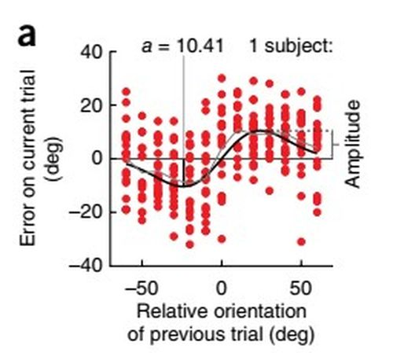

# Rapport de stage

## Cadre du stage

Ce stage de recherche, qui s'est déroulé de mars à juin 2020, a eu lieu dans le cadre du DENS, sous la tutelle de Thérèse Collins, à l'*INCC* (Integrative Neuroscience and Cognition Center, Université de Paris). Il n'était pas rémunéré et officiellement les horaires était d'un jour plein par semaine. Malheureusement, à cause de la pandémie et du confinement qui en a découlé, le stage n'a pas eu lieu au laboratoire, mais s'est déroulé quasiment entièrement en ligne, par le biais de courriels ou de visioconférences.

## Le projet de recherche : dépendance sérielle et image de classification

### La dépendance sérielle

> "*The perception of low-level stimulus features such as orientation and numerosity is systematically biased (i.e., pulled) toward visual input from the recent past. The spatial region over which current orientations are pulled by previous orientations is known as the continuity field, which is temporally tuned for the past 10–15 s*" 

Thérèse Collins, qui était ma tutrice de stage, travaille entre autres sujets sur la "*dépendance sérielle*" dans la perception visuelle. La dépendance sérielle consiste en l'intégration temporelle d'informations telles que l'orientation ou la numérosité. Elle est typiquement mise en évidence dans des expériences exigeant des sujets de juger de l'orientation de barres, où l'on constate que la réponse en *n* des sujets est influencée par la réponse en (n-1), (n-2), et ce jusqu'à environ 15 secondes dans une zone bien délimitée du champ visuel appelée *"continuity field"*, couvrant environ 15 degrés d'angle visuel ((Fischer & Whitney, 2014).

*Résultats tirés de l'article de Fischer et Whitney (2014) sur la dépendance sérielle*

Ce phénomène perceptif de bas-niveau, qui ne s'explique pas par des effets de critères de décision, permettrait ainsi d'assurer une stabilité perceptive. Il constituerait un a priori perceptif en faveur d'un monde stable malgré les informations perceptives perpétuellement changeantes (e.g. la luminosité changeant constamment à cause des nuages passant devant le soleil), au même titre que notre système perceptif assure la constance de taille, de couleur ...

### L'image de classification

> "*The central concept of the technique is the correlation of observer decisions with noisy stimulus features over sets of stimuli. From the correlation of the features with the decisions and the inter-correlations among the features, the investigator can then estimate how the observer is weighting the stimulus features to reach a decision.*" (Eckstein & Ahumada, 2002)

L'image de classification est une technique comportementale employée en psychophysique. Dans sa forme traditionnelle, elle consiste à ajouter du "*bruit visuel*", c'est-à-dire des pixels distribués aléatoirement, aux stimuli présentés aux sujets. Ces derniers réalisent par exemple une tâche de détection classique, comme dire si le chiffre 3 est présent. Avec suffisamment d'essais, il est possible de faire la moyenne des pixels ajoutés aux stimuli dans l'expérience afin d'en tirer une image de classification. Par exemple, si je fais la moyenne des pixels de tous les essais où le sujet a dit que le chiffre 3 était présent alors qu'il ne l'était pas (fausse alarme), j'obtiendrai ce qui en moyenne a poussé le sujet à répondre de cette manière, et donc l'équivalent "*template*" interne du chiffre 3 du sujet. Cette image peut être rendu encore plus claire si je lui soustrais son opposé, son "*négatif*" photographique (pour filer l'exemple, toutes les fois où le sujet a dit que le chiffre 3 était absent alors qu'il était présent). Cette technique, d'abord cantonnée au champ de la psychophysique, est maintenant employée dans d'autres champs de la psychologie.

 https://link.springer.com/article/10.3758/s13428-019-01232-2/figures/1
*Image de classification + source + visuali femi*

L'intérêt de cette technique, et ce qui la rend si intéressante, est sa nature visuelle et le fait qu'on ne sache pas à l'avance ce qu'on va obtenir : "*Is it the visual nature of the classification image, or is it its exploratory nature that resembles a sort of archeology of perceptual processes » that makes it interesting ?*" (Eckstein & Ahumada, 2002).

### Application de la technique de l'image de classification à la dépendance sérielle

L'idée était donc d'étudier la dépendance sérielle, dans une tâche de jugement d'orientation, via la technique de l'image de classification. Cela permettrait de savoir ce qui, dans les stimuli précédant le stimulus actuelle, influençait la réponse actuelle du sujet. Autrement dit, de savoir quels aspects du stimulus intervenaient dans la dépendance sérielle.

Cependant, dans notre expérience, aucun bruit visuel n'a été rajouté aux stimuli. Cela se justifiait dans la mesure où nous ne  voulions pas bruiter les données, et où justement nous étions intéressés par les stimuli précédant le stimulus actuel. Dès lors, comment obtenir l'image de classification ? En faisant la moyenne des pixels des stimuli en (n-1) vus par le sujet, et ayant influencé sa réponse en (n) via le phénomène de la dépendance sérielle. La démarche était alors doublement exploratoire : non seulement nous ne savions pas quelle image nous allions obtenir, mais de surcroît, cette image de classification ne correspondait pas à la technique classique, consistant à faire la moyenne du bruit visuel ajouté aux stimuli présentés pour telle réponse.

2. Méthode

3. Resultats

4. Discussion

5. What I learnt from this experience
