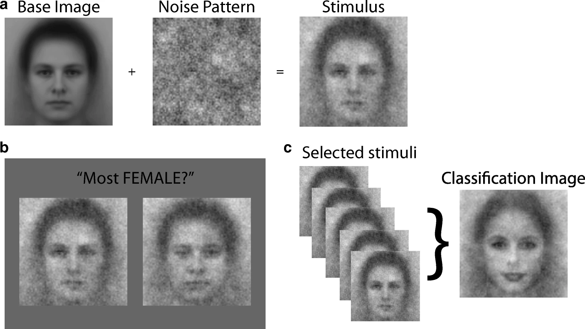
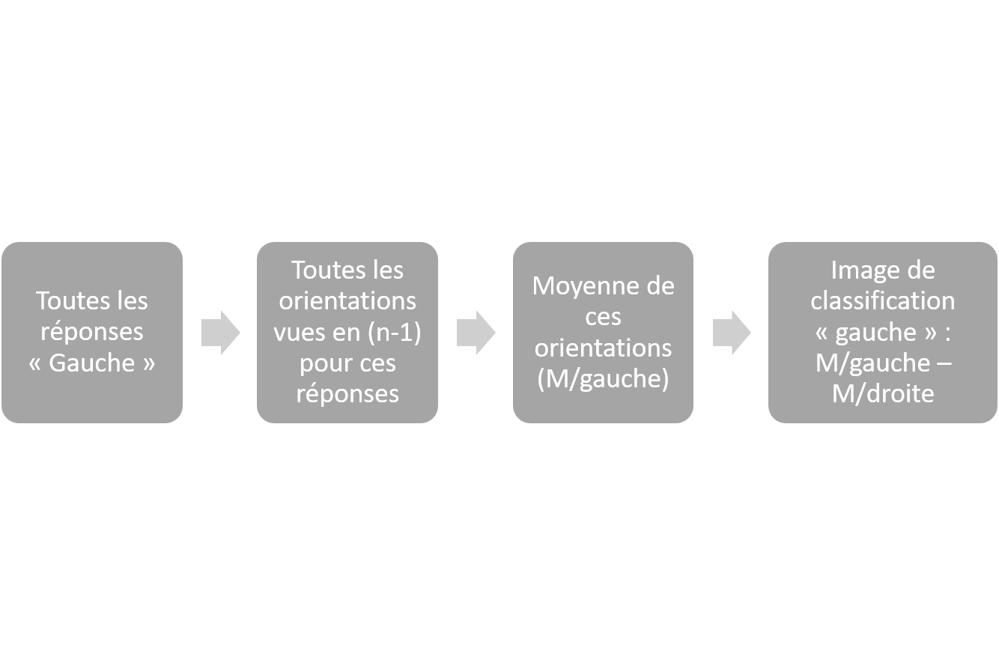
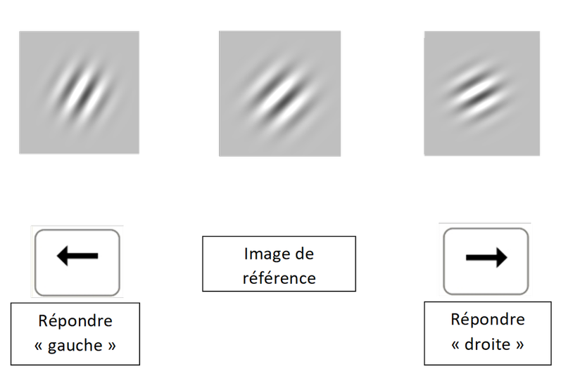
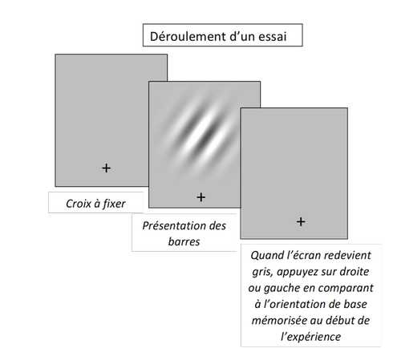
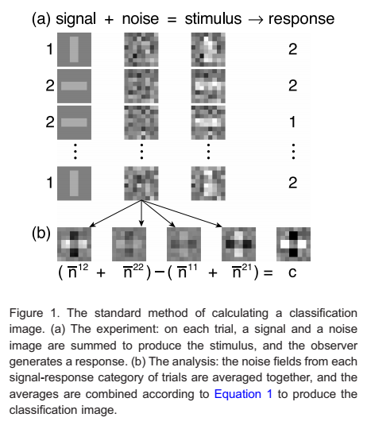

# Rapport de stage

## Le cadre du stage

Ce stage de recherche, qui s'est déroulé de mars à juin 2020, a eu lieu dans le cadre du DENS, sous la tutelle de Thérèse Collins, à l'*INCC* (Integrative Neuroscience and Cognition Center, Université de Paris). Il n'était pas rémunéré et les horaires étaient d'un jour plein par semaine.

Malheureusement, à cause de la situation sanitaire et du confinement qui en a découlé, le stage n'a pas eu lieu au laboratoire, mais s'est déroulé quasiment entièrement à distance, par courriels ou visioconférences.

## Le projet de recherche : dépendance sérielle et image de classification

### La dépendance sérielle

> "*The perception of low-level stimulus features such as orientation and numerosity is systematically biased (i.e., pulled) toward visual input from the recent past. The spatial region over which current orientations are pulled by previous orientations is known as the continuity field, which is temporally tuned for the past 10–15 s*" (Liberman, Fischer & Whitney, 2014)

Thérèse Collins, qui était ma tutrice de stage, travaille entre autres sujets sur la "*dépendance sérielle*" dans la perception visuelle. La dépendance sérielle consiste en l'intégration temporelle d'informations telles que l'orientation ou la numérosité. Elle est typiquement mise en évidence dans des expériences exigeant des sujets de juger de l'orientation de barres, où l'on constate que la réponse en *n* des sujets est influencée par la réponse en (n-1), (n-2), et ce jusqu'à environ 15 secondes dans une zone bien délimitée du champ visuel appelée *"continuity field"*, couvrant environ 15 degrés d'angle visuel ((Fischer & Whitney, 2014).

*Résultats tirés de l'article de Fischer et Whitney (2014) sur la dépendance sérielle : l'essai précédent influence l'essai actuel*

Ce phénomène perceptif de bas-niveau, qui ne s'explique pas par des effets de critères de décision, permettrait ainsi d'assurer une stabilité perceptive. Il constituerait un a priori perceptif en faveur d'un monde stable malgré les informations perceptives perpétuellement changeantes (e.g. la luminosité changeant constamment à cause des nuages passant devant le soleil), au même titre que notre système perceptif assure la constance de taille, de couleur ...

### L'image de classification

> "*The central concept of the technique is the correlation of observer decisions with noisy stimulus features over sets of stimuli. From the correlation of the features with the decisions and the inter-correlations among the features, the investigator can then estimate how the observer is weighting the stimulus features to reach a decision.*" (Eckstein & Ahumada, 2002)

L'image de classification est une technique comportementale employée en psychophysique. Dans sa forme traditionnelle, elle consiste à ajouter du "*bruit visuel*", c'est-à-dire des pixels distribués aléatoirement, aux stimuli présentés aux sujets. Ces derniers réalisent par exemple une tâche de détection classique, comme dire si le chiffre 3 est présent. Avec suffisamment d'essais, il est possible de faire la moyenne des pixels ajoutés aux stimuli dans l'expérience afin d'en tirer une image de classification. Par exemple, si je fais la moyenne des pixels de tous les essais où le sujet a dit que le chiffre 3 était présent alors qu'il ne l'était pas (fausse alarme), j'obtiendrai ce qui en moyenne a poussé le sujet à répondre de cette manière, et donc l'équivalent "*template*" interne du chiffre 3 du sujet. Cette image peut être rendu encore plus claire si je lui soustrais son opposé, son "*négatif*" photographique (pour filer l'exemple, toutes les fois où le sujet a dit que le chiffre 3 était absent alors qu'il était présent). Cette technique, d'abord cantonnée au champ de la psychophysique, est maintenant employée dans d'autres champs de la psychologie.

*Exemple de l'utilisation de l'image de classification en psychologie sociale (Brinkman et al, 2019)*

L'intérêt de cette technique, et ce qui la rend si intéressante, est sa nature visuelle et le fait qu'on ne sache pas à l'avance ce qu'on va obtenir : "*Is it the visual nature of the classification image, or is it its exploratory nature that resembles a sort of archeology of perceptual processes » that makes it interesting ?*" (Eckstein & Ahumada, 2002).

### Application de la technique de l'image de classification à la dépendance sérielle

La tâche était simple : les sujets mémorisaient un *Gabor patch* dans une certaine orientation au tout début de l'expérience. Ensuite, après un bref entraînement, ils devaient indiquer si le stimulus qui s'affichait devant eux était orienté à droite ou à gauche du Gabor de référence.

L'idée était donc d'étudier la dépendance sérielle, dans une tâche de jugement d'orientation, via la technique de l'image de classification. Cela permettrait de savoir ce qui, dans les stimuli précédant le stimulus actuelle, influençait la réponse actuelle du sujet. Autrement dit, de savoir quels aspects du stimulus intervenaient dans la dépendance sérielle.

Cependant, dans notre expérience, aucun bruit visuel n'a été rajouté aux stimuli. Cela se justifiait dans la mesure où nous ne  voulions pas bruiter les données, et où justement nous étions intéressés par les stimuli précédant le stimulus actuel. Dès lors, comment obtenir l'image de classification ? En faisant la moyenne des pixels des stimuli en (n-1) vus par le sujet, et ayant influencé sa réponse en (n) via le phénomène de la dépendance sérielle. 

*Résumé de l'adaptation de la technique de l'image de classification à la dépendance sérielle dans notre expérience (aucun bruit n'est ajouté au stimulus.*

La démarche était alors doublement exploratoire : non seulement nous ne savions pas quelle image nous allions obtenir, mais de surcroît, cette image de classification ne correspondait pas à la technique classique, consistant à faire la moyenne du bruit visuel ajouté aux stimuli présentés pour telle réponse.

## Méthode

### Participants

Les critères d'inclusion étaient d'avoir de 18 à 40 ans, de ne pas avoir de trouble neurologique connu, d'avoir une vision normale ou corrigée et de ne pas prendre de médicaments influençant la vue ou la vigilance. L'échantillonnage était de convenance, dans la mesure où les sujets ont été recrutés par courriel ou sur le réseau social Facebook. L'expérience n'étant pas rémunérée, ils étaient tous volontaires. Au vu des conditions sanitaire et de la fermeture du laboratoire, l'expérience avait lieu en ligne sur la plateforme *Testable.org* (Rezlescu, 2015).

Dix sujets ont passé l'expérience (n = 10), dont 4 garçons et 6 filles d'un âge moyen de 25.2 ans (SD = 2.6). 

### Stimuli

Les *Gabor patchs* ont été créés sur Matlab grâce à la fonction "*CreateProceduralGabor*" de *Psychtoolbox* (Kleiner, Brainard & Peli, 2007). Ils avaient une fréquence spatiale de 0.03 cycles par pixel (?) et un écart-type de 32° (?).

*Exemple de Gabor utilisé dans l'expérience*

### Procédure

Au début de l'expérience, les sujets étaient amenés à mémoriser un Gabor patch dans une orientation de référence (225°), qui leur servirait d'ancre durant toute l'expérience, pour dire si les stimuli présentés étaient à droite ou à gauche de cette ancre.

A chaque essai, une croix de fixation était présentée durant 1 seconde, suivie d'un Gabor patch dans une orientation randomisée entre 200° et 250 pendant 500ms. Le sujet comparait alors cette orientation à l'orientation de référence grâce aux flèches droite et gauche du clavier.

Chaque sujet avait 14 essais d'entraînement au début de l'expérience, dont 8 avec un feedback de succès ou d'échec pour être certain qu'ils avaient bien compris la tâche et mémorisé l'orientation de référence. L'expérience comportait en tout 390 essais par sujet, soit 30 présentation des 13 orientations choisies entre 200° et 250°. L'ordre des présentations était aléatoire, et les sujets avaient le droit de prendre une pause au milieu de l'expérience.

### Calcul de l'image de classification

L'image de classification était obtenue en relevant toutes les orientations en (n-1) - soit les orientations des Gabors vus il y a environ 2 secondes par le sujet - pour toutes les réponses "Gauche" à l'essai (n), de même que pour toutes les réponses "Droite" à l'essai (n). Cela nous donnait deux vecteurs (les orientations des Gabors en n-1 pour les réponses gauches, de même pour les réponses droites). A partir de ces deux vecteurs, on pouvait obtenir deux images en calculant la moyenne, pixel par pixel, des Gabors contenus dans chaque vecteur. L'image de classification était alors calculée en soustrayant l'image moyenne gauche à l'image moyenne droite, afin d'obtenir une image encore plus définie, dans la mesure où ces deux images sont censées êtres en quelque sorte les "*négatifs*" l'une de l'autre.

*Méthode standard pour calculer une image de classification (Murray, 2011)*

Ainsi, nous adaptions la technique de l'image de classification en remplaçant le bruit visuel par les orientations vues en (n-1); le phénomène de dépendance sériel était donc ici la source de "*bruit*" qui influençait les réponses du sujet.

3. Resultats

4. Discussion

5. Ce que j'ai appris de ce stage
